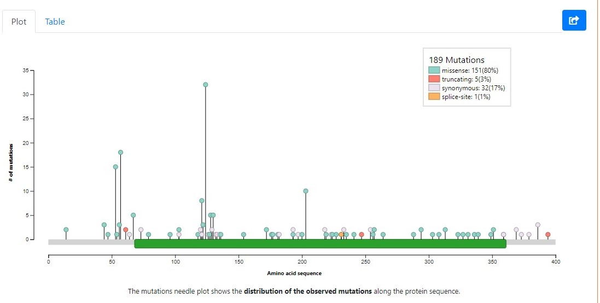
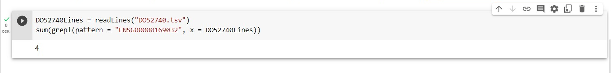
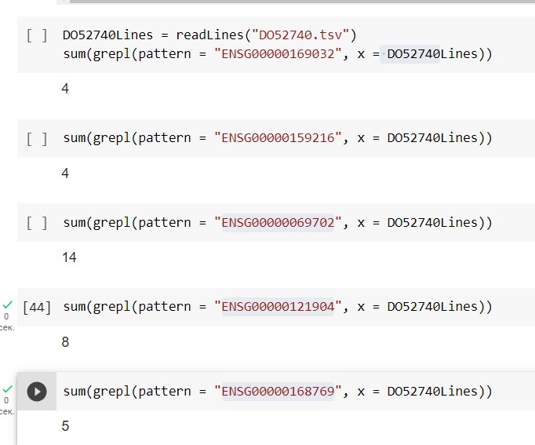

# bioInfa_2
! Так как TSV-файлы очень дольшие и гитхаб не выдерживает, я не стала их вставлять, но они есть в Jupyter Notebook

### Цели : 

Рассмотреть [базу генов рака](http://ncg.kcl.ac.uk/download.php) и выполнить следующие задания:

##### Задание 1:
  1. Найти выбранный ген в базе данных IntOGen. Типы рака, в которых он мутировал? Определить их типы – точечные или структурные (вставки, делиции, транслокации)? Включить скриншот с графическим поиском в отчет.
  2. Произвести поиск выбранного гена на портале [ICGC](https://dcc.icgc.org/): В каких типах рака выбранный ген мутирует?
  
##### Задание 2:  
  1. Скачать с [ICGC](https://dcc.icgc.org/) индивидуальный геном с мутациями
  2. В Data Repository выбрать SSM и рассмотреть координаты одноточечных мутаций для выбранного образца, проверить наличие мутаций в выбранном гене, приложить скриншот.
  3. Рассмотреть 2 пункт еще для 4 генов
  
### Обработка:

Загрузим используемые библиотеки

```{r setoptions & load_library, warning=FALSE,message=FALSE}
library(data.table)
install.packages("DT")
```

Скачиваем список генов с [NCG](http://ncg.kcl.ac.uk/download.php) и читаем его

```{r read}
data <- as.data.frame(fread("NCG_cancerdrivers_annotation_supporting_evidence.tsv"))
DT::datatable(data)
```
<br/>
Мы выбрали ген MAP2K1, и нашли его в [IntOGen](https://www.intogen.org/search?gene=MAP2K1)<br/>
<br/>
У данного гена есть мутации связанные со многими типами рака:

```{r IntOGen Methods}
IntOGen_methods <- as.data.frame(fread("IntOGen-Methods-MAP2K1.tsv"))
DT::datatable(IntOGen_methods)
```

```
A data.frame: 6 × 4
Cancer type	Methods	Samples	Samples (%)
<chr>	<chr>	<int>	<dbl>
Cutaneous melanoma of the skin	CBaSEdNdScvHotMAPSMutPanningCLUSTL	46	4.38
Colorectal adenocarcinoma	HotMAPSMutPanning	11	0.86
Diffuse large B-cell lymphoma	combination	10	2.71
Lung adenocarcinoma	HotMAPS	8	1.06
Non small cell lung cancer	MutPanning	6	1.56
Bladder cancer	CLUSTL	4	0.49

```

Большая часть мутаций являются точечными (80% всех мутаций данного гена приходятся на missense-мутации, которые являются точечными), но также встречаются и структурные
<br/>

<br/>

```{r IntOGen mutations}
IntOGen_mutations <- as.data.frame(fread("IntOGen-Distribution-MAP2K1.tsv"))
DT::datatable(IntOGen_mutations)
```
<br/>
Далее откроем раздел мутаций рассматриваемого гена в [ICGC](https://dcc.icgc.org/genes/ENSG00000169032/mutations), и рассмотрим таблицу исследований различных типов рака, имеющие мутации в данном гене:

```{r ICGC mutations}
icgc_table <- as.data.frame(fread("ENSG00000169032_distribution_2023_03_22_12_10_47.tsv"))
DT::datatable(icgc_table)
```
<br/>

Рассмотрим донора [DO52740](https://dcc.icgc.org/donors/DO52740), его мы выбрали рассмотрев одно из исследований ([CMDI-UK](https://dcc.icgc.org/projects/CMDI-UK)), в котором встречались мутации MAP2K1

```{r ICGC DO52740,warning=FALSE}
DO52740 <- as.data.frame(fread("DO52740.tsv"))
DT::datatable(DO52740)
```
<br/><br/>
У данного донора имеется 4 мутаций в рассматриваемом гене ([ENSG00000169032]([https://dcc.icgc.org/genes/ENSG00000121879?mutations=%7B%22from%22:1%7D](https://www.ensembl.org/Homo_sapiens/Gene/Summary?db=core;g=ENSG00000169032;r=15:66386837-66491656)))
<br/>

<br/>

```{r MAP2K1}
DO52740Lines = readLines("DO52740.tsv")
sum(grepl(pattern = "ENSG00000169032", x = DO52740Lines))
```
Исследование [CMDI-UK](https://dcc.icgc.org/projects/CMDI-UK) рассматривало Хронические миелоидные расстройства (Chronic Myeloid Disorders), а следовательно часть доноров данной выборки имеет мутации связанные с повышенным риском возникновения данного заболевания. Тогда мы можем рассмотреть еще 4 гена из [базы генов рака](http://ncg.kcl.ac.uk/download.php), чьи мутации связаны с данным видом рака (chronic_myeloid_leukemia в поле cancer_type), например:
<br/><br/>
[RUNX1](https://dcc.icgc.org/genes/ENSG00000198796), у данного донора в этом гене можно наблюдать 4 мутаций,

```{r RUNX1}
sum(grepl(pattern = "ENSG00000159216", x = DO41337Lines))
```

[TGFBR3](https://dcc.icgc.org/genes/ENSG00000069702), наблюдаются 14 мутаций,

```{r TGFBR3}
sum(grepl(pattern = "ENSG00000069702", x = DO41337Lines))
```

[CSMD2](https://dcc.icgc.org/genes/ENSG00000121904), наблюдаются 8 мутации,

```{r CSMD2}
sum(grepl(pattern = "ENSG00000121904", x = DO41337Lines))
```

[TET2](https://dcc.icgc.org/genes/ENSG00000168769), наблюдаются 5 мутаций

```{r TET2}
sum(grepl(pattern = "ENSG00000168769", x = DO41337Lines))
```

<br/>

<br/>
